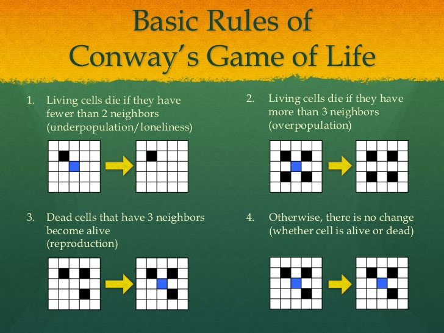

## The Three Rules of TDD

1. You are not allowed to write any production code unless it is to make a failing unit test pass.
2. You are not allowed to write any more of a unit test than is sufficient to fail; and compilation failures are failures.
3. You are not allowed to write any more production code than is sufficient to pass the one failing unit test.

Which means the workflow is:

1. Write a failing test. Stop writing the test as soon as it fails.
2. Write the minimal production code required for the test to pass. Stop writing any code once the test passes.
3. Refactor the test code and the production code without altering the functionality. All tests should pass.

## Usage
To run the tests, run `npm run test`.

For a true TDD experience: use [wallaby.js](https://wallabyjs.com/) with the included `wallaby.js` file.

### To work on a specific Kata

E.G: BowlingGame: `npm run watch src/BowlingGame`

## Webstorm tips

Autocomplete Jest functions:
https://medium.com/front-end-weekly/fix-element-is-not-imported-jest-describe-it-expect-in-webstorm-aaf8c29ae3c2

Node JS / NPM Coding Assistance:
https://intellij-support.jetbrains.com/hc/en-us/community/posts/360001718840-How-to-stop-NodeJS-require-being-flagged-as-unresolved-

# Katas

## Greeter

#### Before you start:
* **Try not to read ahead.**
* **Do one task at a time. The trick is to learn to work incrementally.**

This kata demonstrates the problems of static scoped functions and objects.

All tests should always pass, regardless of environment conditions.

1. Write a `Greeter` class with `greet` function that receives a `name` as input and outputs `Hello <name>`. The signature of `greet` should not change throughout the kata. You are allowed to construct `Greeter` object as you please.
2. `greet` trims the input
3. `greet` capitalizes the first letter of the name
4. `greet` returns `Good morning <name>` when the time is 06:00-12:00
5. `greet` returns `Good evening <name>` when the time is 18:00-22:00
6. `greet` returns `Good night <name>` when the time is 22:00-06:00
7. `greet` logs into console each time it is called

## String Calculator
Made popular by [Roy Osherove](http://osherove.com/tdd-kata-1/).

#### Before you start:
* **Try not to read ahead.**
* **Do one task at a time. The trick is to learn to work incrementally.**
* **Make sure you only test for correct inputs. there is no need to test for invalid inputs for this kata**

This kata is one of the simplest and best ways to practice step-by-step fluent tdd, and provides an easy way to get proficient in a language.

Write a method `add` under an object `StringCalculator` that, given a delimited string, returns the sum of the numbers in the string.

1. An empty string returns zero `'' => 0`
2. A single number returns the value `'1' => 1` `'2' => 2`
3. Two numbers, comma delimited, returns the sum `'1,2' => 3` `'10,20' => 30`
4. Two numbers, newline delimited, returns the sum `'1\n2' => 3`
5. Three numbers, delimited either way, returns the sum `'1\n2,3\n4' => 10`
6. Negative numbers throw an exception with the message `'-1,2,-3' => 'negatives not allowed: -1,-3'`

**stop here if you are a beginner. Continue if you can finish the steps so far in less than 30 minutes.**

7. Numbers greater than 1000 are ignored
8. A single char delimiter can be defined on the first line starting with `//` (e.g `//#\n1#2` for a ‘#’ as the delimiter)
9. A multi char delimiter can be defined on the first line starting with `//` (e.g. `//###\n1###2` for ‘###’ as the delimiter)

## Prime Factors
Made popular by [Uncle Bob](http://butunclebob.com/ArticleS.UncleBob.ThePrimeFactorsKata).

This kata demonstrates the [`transformation priority premise`](https://en.wikipedia.org/wiki/Transformation_Priority_Premise).

Write a function `generate` under a module `PrimeFactors` that, given an integer, returns the list
containing the prime factors in numerical sequence.

* 1 should return `[]`
* 2 should return `[2]`
* 3 should return `[3]`
* 4 should return `[2,2]`
* 5 should return `[5]`
* 6 should return `[2,3]`
* 7 should return `[7]`
* 8 should return `[2,2,2]`
* 9 should return `[3,3]`
* 4620 should return `[2,2,3,5,7,11]`

## Bowling Game
See the original [presentation](http://butunclebob.com/ArticleS.UncleBob.TheBowlingGameKata).

This kata demonstrates the power of doing tests first, and how up-front design decisions can change
and give way to a simpler implementation by coding iteratively.

Write a `BowlingGame` object with methods `roll(pins)` and `getScore()`.

This will be the game engine which follows the rules of bowling:

* The game consists of 10 frames, in each frame the player has the ability to knock down 10 pins.
* The score for the frame is the total number of pins knocked down + bonuses for `strikes` and `spares`.
* A `spare` is when the player knocks down all 10 pins in 2 tries. The bonus for a spare is the next roll.
* A `strike` is when the player knocks down all 10 pins in 1 try. The bonus is the next 2 rolls.
* In the tenth frame a player who rolls a spare / strike gets an extra roll(s) to complete the frame.
* No more than 3 rolls can be rolled in the 10th frame.

# Additional Katas

## FizzBuzz

Write a program that prints the numbers from 1 to 100.
But for multiples of three print “Fizz” instead of the number
and for the multiples of five print “Buzz”.
For numbers which are multiples of both three and five print “FizzBuzz”."

## Roman Numerals Conversion

1. Given an Integer, return as a Roman Numeral
1. Given a Roman Numeral, return as an Integer

## Conway's Game of Life

